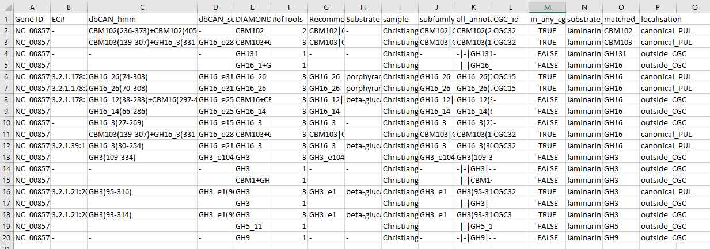
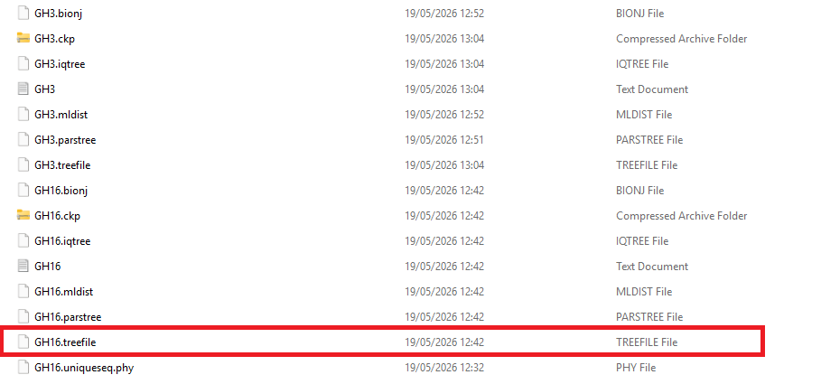
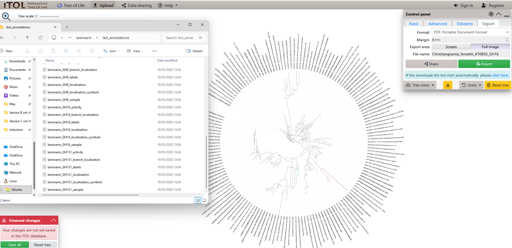
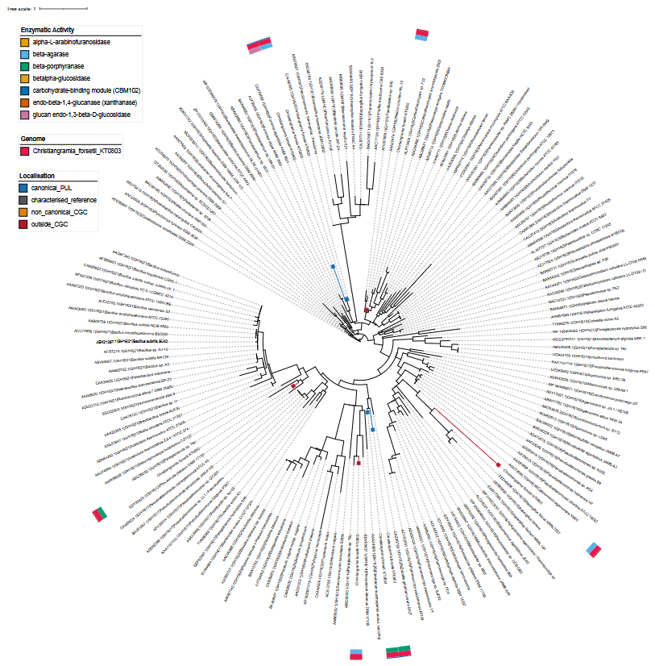
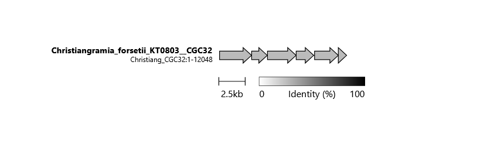

# Tutorial: Analysing laminarin PULs in *Christiangramia forsetii* KT0803

This tutorial walks through a complete SubstrATE run from a raw genome
assembly to interpreted phylogenetic trees and synteny plots, using the
bundled *Christiangramia forsetii* KT0803 genome as input and laminarin
as the target substrate.

*Christiangramia forsetii* KT0803 is a marine Flavobacteriia isolated
from the North Sea. It encodes a well-characterised laminarin PUL,
making it an ideal test case for SubstrATE. **CAUTION: Synteny plots will not render properly when only running one genome. See below for more detail.** 

**Time required:** ~30 minutes with default 8 threads (dominated by dbCAN annotation)

---

## Prerequisites

- SubstrATE installed and conda environment active (see
  [Installation](../README.md#installation))
- dbCAN, EXPASY, and TCDB databases downloaded
- Reference sequence database built (optional — tutorial uses merge
  mode which does not require pre-built reference trees)

---

## 1. Locate the test genome

The *C. forsetii* KT0803 genome is bundled with SubstrATE in the
`tests/data/genomes/` directory:

```bash
ls tests/data/genomes/
```

```
Christiangramia_forsetii_KT0803.fna
```

This is a nucleotide assembly in FASTA format. SubstrATE will run
dbCAN in meta mode, which handles gene prediction internally using
pyrodigal — no separate gene prediction step is needed.

---

## 2. Run the pipeline

Run SubstrATE with laminarin as the target substrate:

```bash
substrate run \
    --substrate laminarin \
    --genomes tests/data/genomes/ \
    --db_dir /path/to/dbcan/db \
    --expasy /path/to/enzyme.dat \
    --tcdb /path/to/tc_family_definitions.tsv \
    --output results/tutorial/
```

Replace `/path/to/...` with your actual database paths. If you followed
the installation guide, these will be wherever you downloaded the
databases during setup.

### What SubstrATE does

The pipeline runs seven steps:

```
Checking required tools...
  ✓ dbCAN:   5.2.8
  ✓ MAFFT:   v7.525
  ✓ trimAl:  1.5
  ✓ IQ-TREE2: 3.1.1
  ✓ clinker: 0.0.32

  Substrate: laminarin (1/1)
Step 1/7: PUL classification...
Step 2/7: Activity annotation...
Step 3/7: Sequence extraction...
Step 4/7: Alignment, trimming and tree building...
Step 5/7: GenBank file generation...
Step 6/7: iTOL annotation files...
Step 7/7: Clinker synteny plot...

  Pipeline complete (X.X min)
  ✓ laminarin    SUCCESS
```
---

## 3. Explore the output

All outputs are written to `results/tutorial/laminarin/`:

```
results/tutorial/
├── logs/
├── cgc_output/                    # dbCAN annotation output
└── laminarin/
    ├── laminarin_family_hits.tsv
    ├── laminarin_substrate_hits.tsv
    ├── laminarin_activity_annotated.tsv
    ├── laminarin_colour_config.tsv
    ├── laminarin_pattern_review.tsv
    ├── sequences/
    ├── alignments/
    ├── trimmed/
    ├── trees/
    ├── itol_annotations/
    ├── genbank/
    └── clinker/
```

### Family hits

To see family hits, open `laminarin_family_hits.tsv` in a spreadsheet application. This
is the core output table — one row per gene hit, with columns for:

- `sample` — genome name
- `Gene ID` — protein identifier
- `matched_family` — CAZyme family matched (e.g. GH16, GH17)
- `CGC_id` — which CGC the gene belongs to
- `localisation` — `canonical_PUL`, `non_canonical_CGC`, or
  `outside_CGC`
- `activity` — enzymatic activity label from EXPASY/dbCAN



*The family hits table showing laminarin-relevant CAZymes in
C. forsetii KT0803, with localisation and activity annotations.*

### Activity annotation

To see activity annotation, open `laminarin_activity_annotated.tsv`. This extends the family hits
table with primary EC numbers and includes reference sequences from
CAZy alongside your genomic sequences. It is used as input for iTOL
annotations and tree interpretation.

### Substrate hits

To see substrate hits, open `laminarin_substrate_hits.tsv`. This shows CGCs where dbCAN's
substrate prediction tool identified laminarin as a likely substrate,
providing an independent line of evidence alongside the CAZyme family
matching.

---

## 4. Phylogenetic trees

SubstrATE builds a separate tree for each CAZyme family with enough
sequences. For laminarin, trees are built for GH16, GH17, GH55, and
other families present in the dataset.

Trees are written to `trees/` as IQ-TREE2 `.treefile` files. They are
designed for use with [iTOL](https://itol.embl.de/) — upload the
treefile and the annotation files from `itol_annotations/` to
visualise them.

> **Note on reproducibility:** Trees built in merge or denovo mode
> are not fully reproducible between runs due to IQ-TREE2's stochastic
> tree search. For reproducible results, fix the random seed:
> ```bash
> substrate run --seed 42 --substrate laminarin ...
> ```
> Place mode trees are fully reproducible without a seed.

### Uploading to iTOL

1. Go to [itol.embl.de](https://itol.embl.de/) and create a free
   account
2. Upload the treefile from `trees/laminarin_GH16.treefile`
3. Drag and drop the annotation files from `itol_annotations/` onto
   the tree

The annotation files colour sequences by:
- **Sample** — which genome each sequence comes from
- **Activity** — enzymatic activity label
- **Localisation** — canonical PUL, non-canonical CGC, or outside CGC







*GH16 tree for C. forsetii KT0803 with sample and activity
annotations. Reference sequences from CAZy are shown in grey.*

### Customising colours

SubstrATE generates a colour configuration file at
`laminarin_colour_config.tsv`. If you want to adjust the colours used for the tree, open this file as a spreadsheet, edit the
colour assignments, and regenerate the iTOL annotations without
rebuilding the tree:

```bash
substrate visualise \
    --substrate laminarin \
    --output results/tutorial/
```

---

## 5. Synteny plot

SubstrATE generates an interactive clinker synteny plot comparing all
qualifying laminarin CGCs. CAUTION: This will not work if substrATE is only run on one genome- it relies on comparison between different genomes. In this example, it was also run on *Christiangramia forsettii* KT0803 and *Zobellia galactanivorans* DSIJ. Open
`clinker/laminarin_all_cgcs.html` in a web browser:



*Clinker synteny plot showing a greyed out PUL CGC diagram for the singular C. forsettii KT0803 genome which has nothing to compare to.*


*Clinker synteny plot showing gene organisation and homology across
laminarin CGCs in C. forsetii KT0803 and Zobellia galactanivorans DSIJ. Coloured blocks represent
genes, connecting lines show homology.*

The plot is interactive — hover over genes to see annotations, click
to highlight homologous groups, and use the controls to adjust the
layout.

---

## 6. Interpreting results

### PUL classification

SubstrATE classifies each CGC into one of three categories:

**`canonical_PUL`** — the CGC contains at least 2 laminarin-relevant
CAZymes co-localised with a SusC/SusD-type transporter (TCDB families
1.B.14 and 8.A.46). This is the hallmark architecture of a
Bacteroidetes PUL and indicates a dedicated laminarin utilisation
system.

**`non_canonical_CGC`** — the CGC contains at least 2
laminarin-relevant CAZymes but no SusC/SusD transporter. May represent
a partial PUL, a PUL with an atypical transporter, or a gene cluster
that contributes to laminarin degradation without a dedicated uptake
system.

**`outside_CGC`** — the gene has a laminarin-relevant CAZyme family
annotation but does not meet the criteria for canonical or
non-canonical classification. These genes may still be biologically
relevant but are not part of a coherent gene cluster.

### What to look for in C. forsetii KT0803

*C. forsetii* KT0803 is known to encode a laminarin PUL centred on
GH16 and GH17 family enzymes. You should see at least one
`canonical_PUL` CGC containing:

- A GH16 laminarinase (endo-1,3-β-glucanase)
- A GH17 or GH3 glucosidase
- A TonB-dependent transporter (SusC-type, TCDB 1.B.14)
- A SusD-like protein (TCDB 8.A.46)

---

## 7. Running on multiple genomes

To compare laminarin PULs across multiple genomes, place all FASTA
files in a single directory and pass it to `--genomes`:

```bash
substrate run \
    --substrate laminarin \
    --genomes /path/to/genome/directory/ \
    --db_dir /path/to/dbcan/db \
    --expasy /path/to/enzyme.dat \
    --tcdb /path/to/tc_family_definitions.tsv \
    --output results/multi_genome/
```

SubstrATE will annotate all genomes, build combined trees with
sequences from all samples, and generate a single clinker plot
comparing CGCs across all genomes.

If you have already run dbCAN annotation and want to skip it on
subsequent runs, use `--dbcan_output` to point directly to the
existing annotation output:

```bash
substrate run \
    --substrate laminarin \
    --dbcan_output results/multi_genome/cgc_output/ \
    --db_dir /path/to/dbcan/db \
    --expasy /path/to/enzyme.dat \
    --tcdb /path/to/tc_family_definitions.tsv \
    --output results/multi_genome/
```

---

## 8. Next steps

- **Analyse additional substrates** — add `--substrate alginate`,
  `--substrate fucoidan` etc. to the same run. SubstrATE runs all
  substrates in a single annotation pass, so dbCAN only runs once
  regardless of how many substrates you analyse.

- **Survey mode** — not sure which substrates are present in your
  dataset? Run without `--substrate` to get a ranked overview of all
  substrates with hits.

- **Strict pattern mode** — use `--pattern_mode strict` for more
  conservative CGC filtering, retaining only CGCs with highly
  substrate-specific enzymatic activities.

- **Custom substrates** — for substrates not in the built-in list,
  use `--substrate_terms` to provide search terms for automatic family
  derivation from the dbCAN database.

