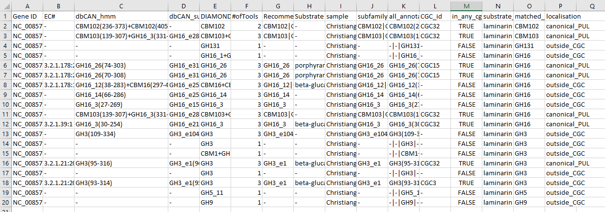
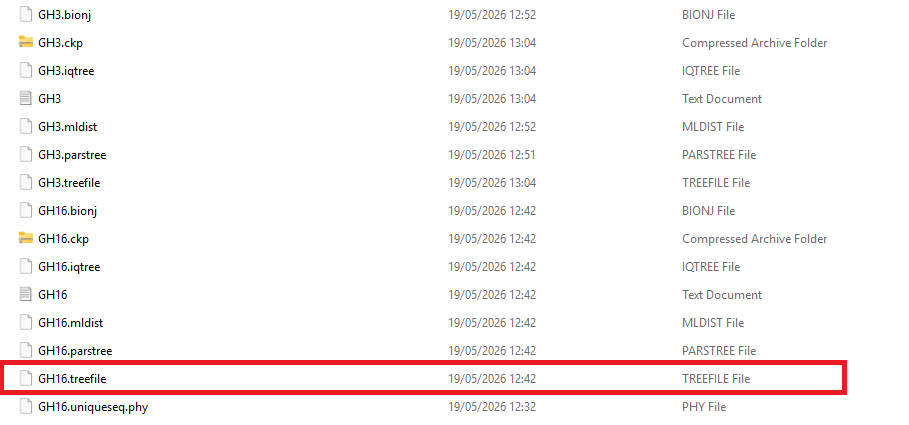
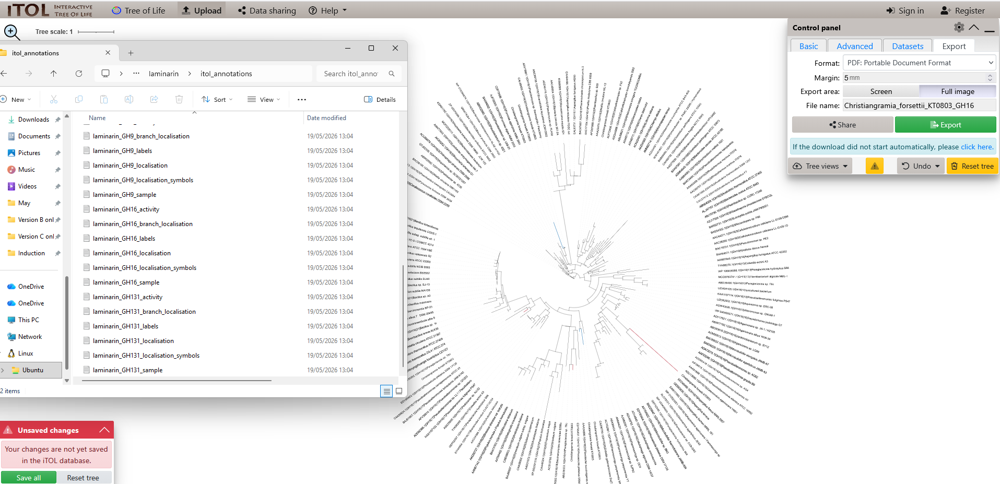
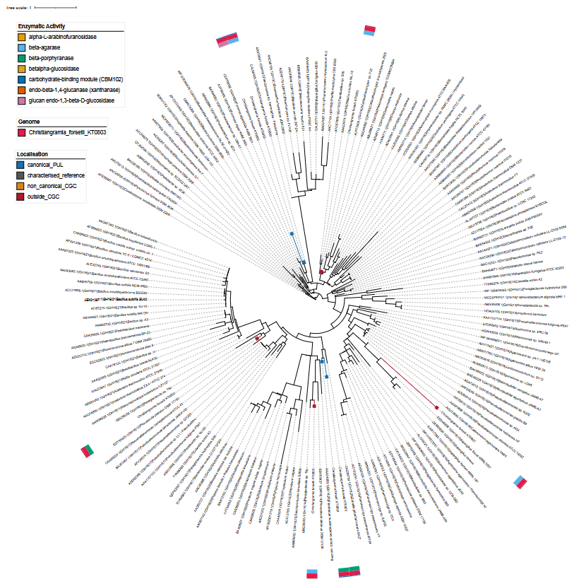
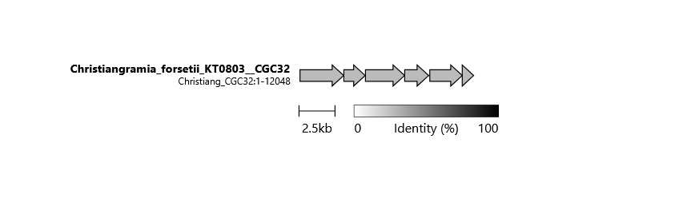
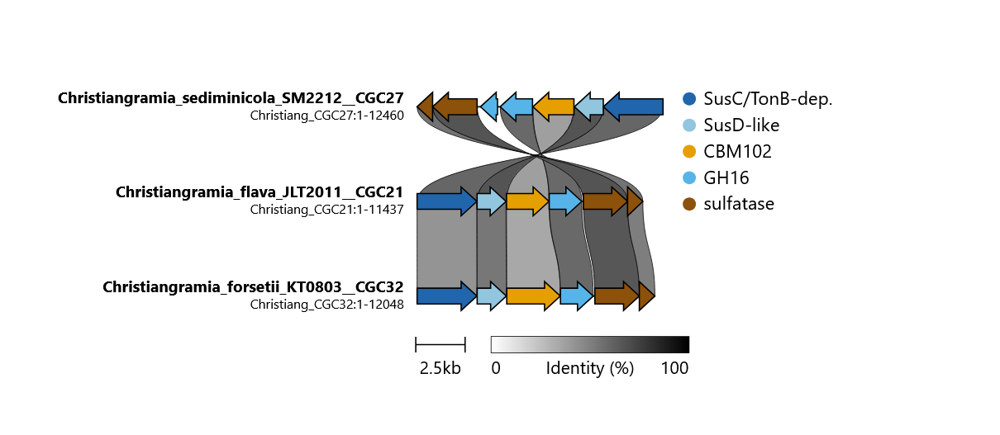

# Tutorial: Analysing laminarin PULs in *Christiangramia forsetii* KT0803

This tutorial walks through a complete SubstrATE run from a raw genome
assembly to interpreted phylogenetic trees and synteny plots, using the
bundled *Christiangramia forsetii* KT0803 genome as input and laminarin
as the target substrate.

*Christiangramia forsetii* KT0803 is a marine Flavobacteriia isolated
from the North Sea. It encodes a well-characterised laminarin PUL,
making it an ideal test case for SubstrATE. **CAUTION: Synteny plots will not render properly when only running one genome. See below for more detail.**

**Time required:** ~30 minutes with default 8 threads (dominated by dbCAN annotation)

---

## Prerequisites

- SubstrATE installed and conda environment active (see
  [Installation](../README.md#installation))
- dbCAN, EXPASY, and TCDB databases downloaded
- Reference sequence database built (optional but recommended — see
  [Reference sequence database](../README.md#reference-sequence-database))

> **What happens without the reference database?** SubstrATE will still
> run successfully but will use merge or denovo mode for tree building
> instead of place mode. Trees will have fewer reference sequences for
> context and phylogenetic placement will be less accurate. The tutorial
> uses merge mode by default since the reference tree database is not
> bundled, but all steps work identically.

---

## 1. Locate the test genome

The *C. forsetii* KT0803 genome is bundled with SubstrATE in the
`tests/data/genomes/` directory:

```bash
ls tests/data/genomes/
```

```
Christiangramia_forsetii_KT0803.fna
```

This is a nucleotide assembly in FASTA format. SubstrATE will run
dbCAN in meta mode, which handles gene prediction internally using
pyrodigal — no separate gene prediction step is needed.

---

## 2. Run the pipeline

Run SubstrATE with laminarin as the target substrate:

```bash
substrate run \
    --substrate laminarin \
    --genomes tests/data/genomes/ \
    --db_dir /path/to/dbcan/db \
    --expasy /path/to/enzyme.dat \
    --tcdb /path/to/tc_family_definitions.tsv \
    --output results/tutorial/ \
    --seed 42
```

Replace `/path/to/...` with your actual database paths. If you followed
the installation guide, these will be wherever you downloaded the
databases during setup.

The `--seed 42` flag fixes the random seed for reproducible trees and
reference sequence subsampling. For publication figures, always use a
fixed seed so results can be exactly reproduced.

### Key optional flags

| Flag | Default | Effect |
|---|---|---|
| `--seed` | None | Fix random seed for reproducible trees and subsampling |
| `--max_ref_seqs` | 50 | Maximum reference sequences appended per family for tree building |
| `--nearest_refs` | 1 | Nearest references per genomic sequence kept for display |
| `--max_display_refs` | 5 | Maximum total references shown in the displayed tree |
| `--ref_mode` | `diverse` | Reference subsampling strategy (`diverse` or `relevant`) |

For a publication-quality run with a larger dataset:
```bash
substrate run \
    --substrate laminarin \
    --genomes /path/to/genomes/ \
    --db_dir /path/to/dbcan/db \
    --expasy /path/to/enzyme.dat \
    --tcdb /path/to/tc_family_definitions.tsv \
    --output results/ \
    --seed 42 \
    --max_ref_seqs 20 \
    --nearest_refs 1 \
    --max_display_refs 5
```

### What SubstrATE does

The pipeline runs seven steps:

```
Checking required tools...
  ✓ dbCAN:   5.2.8
  ✓ MAFFT:   v7.525
  ✓ trimAl:  1.5
  ✓ IQ-TREE2: 3.1.1
  ✓ clinker: 0.0.32

  Substrate: laminarin (1/1)
Step 1/7: PUL classification...
Step 2/7: Activity annotation...
Step 3/7: Sequence extraction...
Step 4/7: Alignment, trimming and tree building...
Step 5/7: GenBank file generation...
Step 6/7: iTOL annotation files...
Step 7/7: Clinker synteny plot...

  Pipeline complete (X.X min)
  ✓ laminarin    SUCCESS
```

---

## 3. Explore the output

All outputs are written to `results/tutorial/laminarin/`:

```
results/tutorial/
├── logs/
├── cgc_output/                    # dbCAN annotation output
└── laminarin/
    ├── laminarin_family_hits.tsv
    ├── laminarin_substrate_hits.tsv
    ├── laminarin_activity_annotated.tsv
    ├── laminarin_colour_config.tsv
    ├── laminarin_pattern_review.tsv
    ├── sequences/
    ├── alignments/
    ├── trimmed/
    ├── trees/
    ├── itol_annotations/
    ├── genbank/
    └── clinker/
```

### Family hits

To see family hits, open `laminarin_family_hits.tsv` in a spreadsheet application. This
is the core output table — one row per gene hit, with columns for:

- `sample` — genome name
- `Gene ID` — protein identifier
- `matched_family` — CAZyme family matched (e.g. GH16, GH17)
- `CGC_id` — which CGC the gene belongs to
- `localisation` — `canonical_PUL`, `non_canonical_CGC`, or
  `outside_CGC`
- `activity` — enzymatic activity label from EXPASY/dbCAN



*The family hits table showing laminarin-relevant CAZymes in
C. forsetii KT0803, with localisation and activity annotations.*

### Activity annotation

To see activity annotation, open `laminarin_activity_annotated.tsv`. This extends the family hits
table with primary EC numbers and includes reference sequences from
CAZy alongside your genomic sequences. It is used as input for iTOL
annotations and tree interpretation.

### Substrate hits

To see substrate hits, open `laminarin_substrate_hits.tsv`. This shows CGCs where dbCAN's
substrate prediction tool identified laminarin as a likely substrate,
providing an independent line of evidence alongside the CAZyme family
matching.

---

## 4. Activity patterns

After each run, SubstrATE writes a `{substrate}_pattern_review.tsv` file
to the substrate output directory. For this tutorial run it will be at:

```
results/tutorial/laminarin/laminarin_pattern_review.tsv
```

Open it to see which activity patterns matched genes in your dataset,
how many genes matched each pattern, and whether each pattern is marked
`reviewed=True` or `reviewed=False`.

Patterns marked `reviewed=True` have been manually inspected against
characterised reference strains and are used preferentially. Patterns
marked `reviewed=False` are auto-derived from the dbCAN
fam-substrate-mapping database. If SubstrATE prints a warning about
unreviewed patterns, it means the bundled `activity_patterns.tsv` has
not yet been updated with the latest curated release.

### Downloading the latest curated patterns

To download the latest curated `activity_patterns.tsv` from GitHub
releases:

```bash
substrate download-patterns
```

SubstrATE checks your installed version against the latest release and
prompts for confirmation before overwriting. Use `--force` to skip the
prompt:

```bash
substrate download-patterns --force
```

After downloading, re-run the pipeline to apply the updated patterns.

---

## 5. Phylogenetic trees

SubstrATE builds a separate tree for each CAZyme family with enough
sequences. For laminarin, trees are typically built for GH16, GH17,
GH3, and other families present in the dataset.

> **Note on reproducibility:** Trees built in merge or denovo mode
> are not fully reproducible between runs due to IQ-TREE2's stochastic
> tree search. For reproducible results, fix the random seed with
> `--seed 42`. The same seed also controls reference sequence
> subsampling, so results are fully reproducible end-to-end.
> Place mode trees are fully reproducible without a seed since the
> reference topology is fixed.

### Reference sequences in the tree

SubstrATE automatically appends characterised reference sequences from
CAZy to each family's FASTA before tree building. These are
experimentally characterised enzymes with known EC numbers — they
provide phylogenetic context and help interpret the enzymatic activities
of your genomic sequences by showing where they cluster relative to
characterised enzymes.

Reference sequences are selected by CAZyme family (e.g. all
characterised GH16 sequences), not by substrate, so your sequences are
placed in the context of the full known functional diversity of that
family.

**Two trees are written per family:**

- `trees/GH16.treefile` — the full tree used for IQ-TREE2 inference,
  containing all reference sequences (up to `--max_ref_seqs`)
- `trees/GH16.pruned.treefile` — a pruned version for display, keeping
  only the reference sequences nearest to your genomic sequences

Always upload the **pruned treefile** to iTOL for publication figures.
The full treefile is preserved for reference.

### Controlling reference sequence display

The number of displayed references is controlled by two flags:

- `--nearest_refs` (default 1) — for each genomic sequence, keep this
  many nearest reference sequences (by branch length in the final tree)
- `--max_display_refs` (default 5) — cap the total references displayed
  per tree; if `--nearest_refs` would keep more, the references nearest
  to the most genomic sequences are prioritised

To experiment with different pruning settings without rebuilding trees:

```bash
substrate visualise \
    --substrate laminarin \
    --output results/tutorial/ \
    --nearest_refs 2 \
    --max_display_refs 10
```

Set `--nearest_refs 0` to disable pruning and display all reference
sequences.

### Uploading to iTOL

1. Go to [itol.embl.de](https://itol.embl.de/) and create a free
   account
2. Upload the **pruned** treefile: `trees/GH16.pruned.treefile`
3. Drag and drop all annotation files from `itol_annotations/` onto
   the tree

The annotation files provide several independent layers:

| File | Layer | Description |
|---|---|---|
| `*_sample.txt` | Genome colour strip | Which genome each sequence comes from |
| `*_activity.txt` | Activity colour strip | Enzymatic activity label |
| `*_localisation.txt` | Localisation colour strip | canonical_PUL / non_canonical_CGC / outside_CGC |
| `*_localisation_symbols.txt` | Localisation symbols | Same information as symbols at leaf tips |
| `*_branch_localisation.txt` | Branch colours | Localisation shown on branches |
| `*_labels.txt` | Clean labels | Human-readable sequence names |
| `*_label_styles.txt` | Label bold styling | Genomic sequences shown in bold |

> **iTOL tip:** The localisation ring (`*_localisation.txt`) and
> localisation symbols (`*_localisation_symbols.txt`) are separate
> datasets with independent legends. You can hide the ring while keeping
> the symbols visible — each has its own toggle in the iTOL Datasets
> panel. Genomic sequences are displayed in **bold**; reference
> sequences from CAZy are in normal weight.

> **Reading reference sequences:** Reference sequences appear as grey
> tips in the localisation strip (labelled `characterised_reference`).
> Their activity strip shows their known enzymatic activity in a pastel
> colour palette distinct from the genomic activity colours. This lets
> you immediately see which characterised enzyme your genomic sequences
> cluster nearest to.







*GH16 tree for C. forsetii KT0803 with sample, activity, and
localisation annotations. Reference sequences from CAZy are shown with
grey localisation strips and pastel activity colours.*

### Customising colours

SubstrATE generates a colour configuration file at
`laminarin_colour_config.tsv`. Open this file as a spreadsheet, edit
the hex colour assignments for any sample, activity, or localisation
category, then regenerate the iTOL annotations without rebuilding the
tree:

```bash
substrate visualise \
    --substrate laminarin \
    --output results/tutorial/ \
    --colour_config results/tutorial/laminarin/laminarin_colour_config.tsv
```

---

## 6. Synteny plot

SubstrATE generates an interactive clinker synteny plot comparing all
qualifying laminarin CGCs. CAUTION: This will not work if SubstrATE is only run on one genome — it relies on comparison between different genomes. In this example, it was also run on *Christiangramia forsetii* KT0803, *Christiangramia flava* JLT2011 and *Christiangramia sediminicola* SM2212 for the sake of showing what the plot should actually look like. Open
`clinker/laminarin_all_cgcs.html` in a web browser:



*Clinker synteny plot showing a greyed out PUL CGC diagram for the singular C. forsetii KT0803 genome which has nothing to compare to.*



*Clinker synteny plot showing gene organisation and homology across
laminarin CGCs in *Christiangramia forsetii* KT0803, *Christiangramia flava* JLT2011 and *Christiangramia sediminicola* SM2212. Coloured blocks represent
genes, connecting lines show homology.*

The plot is interactive (when opened as an .html in browser) — hover over genes to see annotations, click
to highlight homologous groups, and use the controls to adjust the
layout.

---

## 7. Interpreting results

### PUL classification

SubstrATE classifies each CGC into one of three categories:

**`canonical_PUL`** — the CGC contains at least 2 laminarin-relevant
CAZymes co-localised with a SusC/SusD-type transporter (TCDB families
1.B.14 and 8.A.46). This is the hallmark architecture of a
Bacteroidetes PUL and indicates a dedicated laminarin utilisation
system.

**`non_canonical_CGC`** — the CGC contains at least 2
laminarin-relevant CAZymes but no SusC/SusD transporter. May represent
a partial PUL, a PUL with an atypical transporter, or a gene cluster
that contributes to laminarin degradation without a dedicated uptake
system.

**`outside_CGC`** — the gene has a laminarin-relevant CAZyme family
annotation but does not meet the criteria for canonical or
non-canonical classification. These genes may still be biologically
relevant but are not part of a coherent gene cluster.

### What to look for in C. forsetii KT0803

*C. forsetii* KT0803 is known to encode a laminarin PUL centred on
GH16 and GH17 family enzymes. You should see at least one
`canonical_PUL` CGC containing:

- A GH16 laminarinase (endo-1,3-β-glucanase)
- A GH17 or GH3 glucosidase
- A TonB-dependent transporter (SusC-type, TCDB 1.B.14)
- A SusD-like protein (TCDB 8.A.46)

### Reading the phylogenetic trees

When interpreting the trees in iTOL:

- **Bold labels** — your genomic sequences
- **Normal weight labels** — characterised reference sequences from CAZy
- **Grey localisation strip** — reference sequences (`characterised_reference`)
- **Pastel activity colours** — reference sequence enzymatic activities
- **Saturated activity colours** — genomic sequence enzymatic activities

Look for your genomic sequences clustering near references with known
activities — this is the primary evidence for substrate annotation. A
GH16 sequence clustering with characterised laminarinases (endo-1,3-β-glucanase,
EC 3.2.1.39) is strong support for laminarin activity.

---

## 8. Running on multiple genomes

To compare laminarin PULs across multiple genomes, place all FASTA
files in a single directory and pass it to `--genomes`:

```bash
substrate run \
    --substrate laminarin \
    --genomes /path/to/genome/directory/ \
    --db_dir /path/to/dbcan/db \
    --expasy /path/to/enzyme.dat \
    --tcdb /path/to/tc_family_definitions.tsv \
    --output results/multi_genome/ \
    --seed 42 \
    --max_ref_seqs 20 \
    --nearest_refs 1 \
    --max_display_refs 5
```

SubstrATE will annotate all genomes, build combined trees with
sequences from all samples, and generate a single clinker plot
comparing CGCs across all genomes.

If you have already run dbCAN annotation and want to skip it on
subsequent runs, use `--dbcan_output` to point directly to the
existing annotation output:

```bash
substrate run \
    --substrate laminarin \
    --dbcan_output results/multi_genome/cgc_output/ \
    --db_dir /path/to/dbcan/db \
    --expasy /path/to/enzyme.dat \
    --tcdb /path/to/tc_family_definitions.tsv \
    --output results/multi_genome/ \
    --seed 42
```

---

## 9. Next steps

- **Analyse additional substrates** — add `--substrate alginate`,
  `--substrate fucoidan` etc. to the same run. SubstrATE runs all
  substrates in a single annotation pass, so dbCAN only runs once
  regardless of how many substrates you analyse.

- **Survey mode** — not sure which substrates are present in your
  dataset? Omit `--substrate` from `substrate run` to get a ranked
  overview of all substrates with hits, then select interactively.
  To survey existing dbCAN output without re-running annotation:
  ```bash
  substrate survey \
      --dbcan_output /path/to/cgc_output/ \
      --db_dir ~/db \
      --expasy /path/to/enzyme.dat \
      --tcdb /path/to/tc_family_definitions.tsv
  ```

- **Strict pattern mode** — use `--pattern_mode strict` for more
  conservative CGC filtering, retaining only CGCs with highly
  substrate-specific enzymatic activities.

- **Custom substrates** — for substrates not in the built-in list,
  use `--substrate_terms` to provide search terms for automatic family
  derivation from the dbCAN database.

- **Adjusting tree display** — experiment with `--nearest_refs` and
  `--max_display_refs` via `substrate visualise` to find the right
  balance between phylogenetic context and figure readability without
  rebuilding trees.
